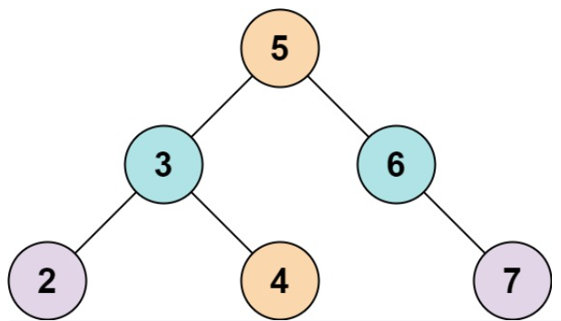

## [Two Sum IV - Input is a BST](https://leetcode.com/problems/two-sum-iv-input-is-a-bst/)

Given the root of a Binary Search Tree and a target number k, return true if there exist two elements in the BST such that their sum is equal to the given target.

*Example-1:*

```
Input: root = [5,3,6,2,4,null,7], k = 9
Output: true
```

*Example-2:*
```
Input: root = [5,3,6,2,4,null,7], k = 28
Output: false
```

*Constraints:*

- The number of nodes in the tree is in the range [1, 104].
- -104 <= Node.val <= 104
- root is guaranteed to be a valid binary search tree.
- -10^5 <= k <= 10^5